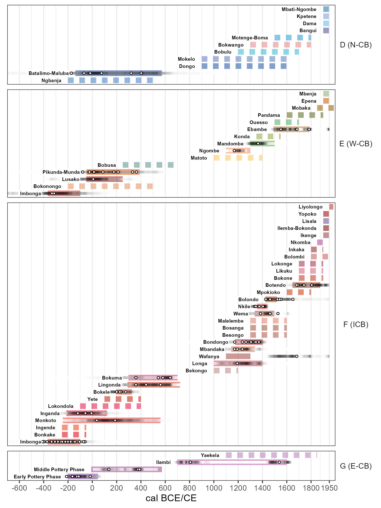

# Pikunda-Munda and Batalimo Maluba: Archaeological Investigations of the Iron Age Settlement History of the western and northern Congo Basin

This repository contains all data and scripts required to reproduce the figures in DOI:[10.1007/s10437-024-09576-7](https://link.springer.com/10.1007/s10437-024-09576-7)

<em>Temporal distribution of pottery styles in the Congo Basin.</em>

### Licenses

**Text and figures :** [CC-BY-4.0](http://creativecommons.org/licenses/by/4.0/)

**Data :** [CC-0](http://creativecommons.org/publicdomain/zero/1.0/)
attribution requested in reuse

**Code :** [MIT License](https://opensource.org/licenses/MIT)
